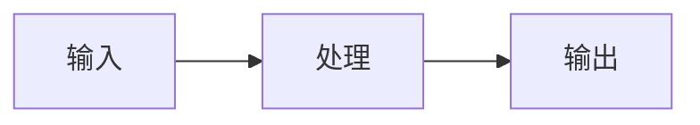
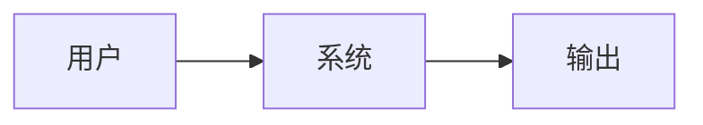
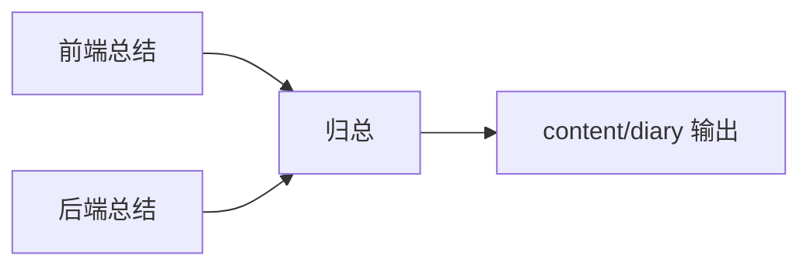

# 日记 / 日志编写规范（供 Agent 与人共用）

> 目标：在 `ai-ink-brain/content/diary/` 持续产出**可阅读、可检索、可引用**的日记；同时满足「公众号引用段单次 ≤ 300 字」的排版约束。

---

## 1. 文件命名（强制）

- **文件名**：统一为日期（推荐 `YYYY-MM-DD.md`）。  
  - 兼容历史：如已存在 `YYYY-M-D.md`，可继续使用，但**新增**建议统一到 `YYYY-MM-DD.md`，便于排序与检索。

---

## 2. 标题规则（强制）

- **学习日记**（已确认是学习主题）：H2 标题统一为  
  **`## DayXX YYYY-MM-DD: {{ 标题 }}`**  
  - `DayXX`：两位数字（如 `Day03`、`Day14`），与学习计划天数对齐。  
  - 日期必须是 `YYYY-MM-DD`，避免 `YYYY-M-D` 造成检索不稳定。  

- **项目/工作日记**（非学习主题）：可不带 Day，但仍建议包含日期与清晰主题，例如：  
  **`## YYYY-MM-DD: {{ 标题 }}`**

---

## 3. 内容结构（推荐，但建议尽量遵循）

建议按以下顺序组织，保持「人一眼能读」+「RAG 易切块」：

- `### 日期与进度概览`
  - 日期、当前阶段、关键词（3–8 个）
- `---`
- `## 1) 今日关键目标`
- `## 2) 关键产出 / 决策（Why + What）`
- `## 3) 实现要点（How，尽量可复用）`
- `## 4) 风险与坑位（包含排障线索，但不要写本地路径）`
- `## 5) 明日计划（可执行 checklist）`
- `---`
- `## 工程图 / 过程图（可选）`

---

## 4. 美化与可读性（推荐）

- **强调**：适度用加粗突出结论、指标、约束条件。  
- **分隔**：使用 `---` 把段落切干净，避免长墙。  
- **列表**：优先列表化；每个列表项尽量一行一个意思。  
- **代码**：只保留“关键片段”，避免整段长贴。  

---

## 5. 截图占位（强制规则）

若某处需要截图，必须留下占位块，并说明**截图内容需求**（让后续补图的人能按要求截）：

```text
【截图占位：{{ 场景/页面 }}】
- 需要展示：{{ 具体元素/数据/状态 }}
- 期望视角：{{ 全屏/局部/高亮区域 }}
- 备注：{{ 是否打码、是否隐藏密钥、是否需要深色模式 }}
```

---

## 6. Mermaid 工程图（可选但鼓励）

可用于流程、数据流、模块边界；尽量用 `flowchart LR` 或 `sequenceDiagram`，节点文字短一些。

示例：



---

## 7. 引用与「不出现本地路径」（强制规则）

- **不要出现本地绝对路径**（例如 `/Users/...`）。  
- **引用时只保留核心部分**：例如文件名、模块名、关键函数名、或相对路径片段（不带机器用户名）。  
- **公众号 300 字限制**：当需要贴长引用（> 300 字）时，必须拆成多段，每段前标注 `引用 1/2`、`引用 2/2`，并确保单段 ≤ 300 字。

---

## 8. 模板（复制即用）

```markdown
## DayXX YYYY-MM-DD: {{ 标题 }}

### 日期与进度概览
- **日期**：YYYY 年 M 月 D 日
- **进度**：{{ 一句话 }}
- **关键词**：{{ 3~8 个 }}

---

## 1) 今日关键目标
- {{ 目标 1 }}
- {{ 目标 2 }}

## 2) 关键产出 / 决策（Why + What）
- **决策**：{{ 结论 }}
  - **原因**：{{ 为什么 }}
  - **影响面**：{{ 影响到哪些模块/体验 }}

## 3) 实现要点（How）
- {{ 要点 1 }}
- {{ 要点 2 }}

## 4) 风险与坑位
- {{ 坑 1：现象 / 原因 / 规避 }}

【截图占位：{{ 场景/页面 }}】
- 需要展示：{{ 具体元素/数据/状态 }}
- 期望视角：{{ 全屏/局部/高亮区域 }}
- 备注：{{ 打码/隐藏密钥等 }}

## 5) 明日计划
- [ ] {{ TODO 1 }}
- [ ] {{ TODO 2 }}

---

## 工程图（可选）


```

---

## 9. 归总模板（总设用：按日期聚合前后端总结）

> 目标：以同一天 `YYYY-MM-DD` 为索引，把前后端的“知识总结素材”聚合成最终日记正文，输出到 `ai-ink-brain/content/diary/`。

### 9.1 输入来源（按日期检索）

- 前端素材：`ai-ink-brain/docs/diary/YYYY-MM-DD.md`
- 后端素材：`ai-ink-brain-api-python/docs/diary/YYYY-MM-DD.md`

同一天可能只有一侧存在，也可能两侧都存在；允许多份来源合并。

### 9.2 输出位置（强制）

- 最终日记：`ai-ink-brain/content/diary/YYYY-MM-DD.md`

### 9.3 归总写作步骤（推荐）

1. 先写 **TL;DR（1 段）**：当天最重要的 1–3 个结论（面向读者）。
2. 再写 **今日关键目标 / 关键产出**：把“决策与结果”放前面。
3. 把前后端素材里的技术细节折叠为 **实现要点** 与 **坑位排障**。
4. 若需要引用素材原文，按 **≤ 300 字** 拆分引用段（见 9.4）。
5. 有截图需求就留 **截图占位块**（见第 5 节）。
6. 如当天涉及架构或流程变化，补一张 **Mermaid 图**（可选）。

### 9.4 引用拆分模板（公众号 ≤ 300 字）

当需要直接引用“素材日记”的原文片段时：

- 单段 ≤ 300 字（强制）
- 超过则拆为多段，并编号

```text
【引用 1/2｜来源：前端总结 YYYY-MM-DD】
{{ <= 300 字的核心引用段 }}

【引用 2/2｜来源：前端总结 YYYY-MM-DD】
{{ <= 300 字的续段引用 }}
```

### 9.5 归总正文模板（复制即用）

```markdown
## YYYY-MM-DD: {{ 当天标题（面向读者） }}

### TL;DR
- {{ 结论 1 }}
- {{ 结论 2 }}
- {{ 结论 3（可选） }}

---

## 1) 今日关键目标
- {{ 目标 1 }}
- {{ 目标 2 }}

## 2) 关键产出 / 决策（Why + What）
- **产出/决策**：{{ 一句话 }}
  - **原因**：{{ 为什么 }}
  - **影响面**：{{ 前端/后端/协作的影响 }}

## 3) 前端侧总结（可选）
- {{ 从前端 docs/diary 提炼的要点 }}

## 4) 后端侧总结（可选）
- {{ 从后端 docs/diary 提炼的要点 }}

## 5) 风险与坑位（含排障线索）
- {{ 坑位 1：现象 / 原因 / 规避 }}

【截图占位：{{ 场景/页面/日志面板 }}】
- 需要展示：{{ 具体元素/数据/状态 }}
- 期望视角：{{ 全屏/局部/高亮区域 }}
- 备注：{{ 打码/隐藏密钥等 }}

---

## 工程图（可选）


```

