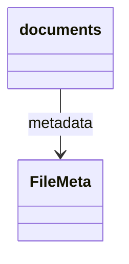

# 图论加速 AI 协作 — 技术实施方案

| 项 | 内容 |
| --- | --- |
| 版本 | v1.0 |
| 日期 | 2026-05-14 |
| 关联 | `_tech_graph/` 拓扑图规范、Harness 多帽子流程、`tech_graph_contract_manifest.json` |
| 实现工具 | Python 3.11+（脚本）、Cursor（工具调用）、CI（GitHub Actions / GitLab CI） |

## 概述

本方案基于已有 Mermaid 拓扑图（`.ai.md` 双轨制）与契约 JSON，补充机器可查询的依赖图，让 AI 在任务规划、影响分析时能以极低 token 消耗、确定性方式获取依赖关系。三个方案为递进关系，可根据项目规模选择实施。

## 三者关系

| 方案 | 名称 | 核心产出 | 适用规模 | 前置依赖 |
| --- | --- | --- | --- | --- |
| 方案1 | 静态依赖矩阵导出 | `graph.json` | 小～中（节点 <500） | 无 |
| 方案2 | 内存图查询工具 | `graph_query.py` + Cursor 工具调用 | 中～大（节点 <2000） | 方案1 |
| 方案3 | 图数据库（Neo4j） | Neo4j 实例 + Cypher 查询接口 | 超大（节点 >1000） | 方案1（可选） |

## 方案1：静态依赖矩阵导出

### 1.1 目标

从 `_tech_graph/*.ai.md` 中自动提取所有流程图（flowchart）的边关系，以及类图（classDiagram）的关联关系，生成一个单一 JSON 文件 `_tech_graph/graph.json`，供 AI 直接读取。

### 1.2 输入

- 所有 `_tech_graph/*.ai.md` 文件（必须符合 `99_mermaid_protocol.md` 语法）。
- 可选：`_tech_graph/00_main.md`、`_tech_graph/10_flow_rag.ai.md` 等。

### 1.3 输出

`_tech_graph/graph.json`，结构如下：

```json
{
  "schema_version": "graph_v1",
  "generated_at": "2026-05-14T10:00:00Z",
  "nodes": ["rag", "fts", "text2sql", "supabase_rpc", "unified_chat", "code_chunks", "documents", "FileMeta"],
  "edges": [
    {"from": "rag", "to": "fts", "type": "depends_on", "sync": true},
    {"from": "rag", "to": "text2sql", "type": "depends_on", "sync": true},
    {"from": "text2sql", "to": "supabase_rpc", "type": "depends_on", "sync": true},
    {"from": "unified_chat", "to": "rag", "type": "triggers", "async": false},
    {"from": "documents", "to": "FileMeta", "type": "has_metadata"},
    {"from": "code_chunks", "to": "FileMeta", "type": "has_metadata"}
  ]
}
```

- **nodes**：所有出现的实体名（流程图节点、类图中的类名）。
- **edges**：每条有向边，`type` 可取值：
  - `depends_on`（默认）— 对应 `-->`
  - `async_calls` — 对应 `~>`
  - `condition` — 对应 `?>`
  - `has_metadata` — 对应 `classDiagram` 中的 `-->`
  - 其他元关系 `::xxx` 转为 `xxx`
- **sync**：布尔值，`true` 为同步（`-->` 或 `::xxx`），`false` 为异步（`~>`）。

### 1.4 技术实现

编写 Python 脚本 `tools/export_graph_json.py`：

1. 遍历 `docs/_tech_graph/` 下所有 `.ai.md` 文件（可配置忽略 `99_*`）。
2. 用正则或轻量解析器提取：
   - flowchart 块中的边定义：`A --> B`、`A ~> B`、`A ?> B`、`A ::xxx B`。
   - classDiagram 块中的关联：`A --> B`。
3. 收集所有节点名（边两端的标识符）。
4. 输出 `graph.json` 到同一目录。
5. 若文件已存在，覆盖。

调用方式：

```text
python tools/export_graph_json.py --input docs/_tech_graph --output docs/_tech_graph/graph.json
```

### 1.5 集成到 CI

- 在 PR 流程中增加步骤：检查 `graph.json` 是否与源文件一致。
- 可运行脚本重新生成，然后 `git diff --exit-code` 检测变化；若有变化但 PR 未提交新的 `graph.json`，则 CI 失败并提示「请运行 `tools/export_graph_json.py` 并提交 `graph.json`」。

### 1.6 使用方式（AI）

在 `.cursorrules` 或帽子 Prompt 中增加：

> 在分析影响范围前，必须先读取 `docs/_tech_graph/graph.json`。该文件列出了所有模块间的依赖关系。你需要根据 `edges` 数组找出当前修改节点（`from`）的下游节点（`to`）。

### 1.7 验收标准

- [ ] 脚本能正确解析至少 3 个示例 `.ai.md` 文件。
- [ ] 生成的 `graph.json` 节点数与 Mermaid 图中实际节点数一致。
- [ ] CI 集成后，修改 `.ai.md` 但不更新 `graph.json` 会触发失败。
- [ ] AI 能根据 JSON 回答「修改 X 会影响谁」并输出正确列表。

## 方案2：内存图查询工具（Cursor 可调用）

### 2.1 目标

在方案1基础上，提供确定性图查询函数，AI 通过 Cursor 工具调用（`@tool` 或 `execute_command`）获取影响集，不再需要 AI 自己解析 JSON。

### 2.2 输入

方案1生成的 `graph.json`（或直接读取 Mermaid 源文件作为备选）。

### 2.3 输出

Python 模块 `tools/graph_query.py`，提供以下函数：

| 函数签名 | 描述 | 示例 |
| --- | --- | --- |
| `get_downstream(node: str, depth: int = 1) -> list[str]` | 返回下游 `depth` 层内的所有节点 | `get_downstream("rag", 2)` → `["fts", "text2sql"]` |
| `get_upstream(node: str, depth: int = 1) -> list[str]` | 返回上游 `depth` 层内的所有节点 | `get_upstream("supabase_rpc", 1)` → `["text2sql"]` |
| `has_path(from_node: str, to_node: str) -> bool` | 检查是否存在有向路径 | `has_path("rag", "supabase_rpc")` → `True` |
| `get_all_affected(nodes: list[str], depth: int = 1) -> set[str]` | 给定一组起始节点，返回所有受影响节点（并集） | `get_all_affected(["rag", "text2sql"])` → `{"fts","supabase_rpc"}` |
| `describe_impact(node: str) -> str` | 返回人类可读的影响描述（可用于生成任务文档） | 返回「修改 rag 将直接影响 fts, text2sql；间接影响 supabase_rpc」 |

### 2.4 技术实现

- 使用 `graph_query.py` 在启动时加载 `graph.json` 构建邻接表（内存）。
- 所有查询基于 BFS/DFS，时间复杂度 O(N+E)。
- 提供命令行接口（CLI）方便 AI 通过 `execute_command` 调用：

```text
python tools/graph_query.py --downstream rag --depth 2
# 输出: fts,text2sql
```

### 2.5 集成到 Cursor

- **方法A（简单）**：AI 使用 `execute_command` 调用 CLI 脚本，获取输出文本。
- **方法B（推荐）**：将 `graph_query.py` 中的函数注册为 Cursor MCP 工具（需配置 `.cursor/mcp.json`），AI 可以直接「调用」函数，无需模拟终端。

示例 `.cursor/mcp.json`：

```json
{
  "mcpServers": {
    "graph-query": {
      "command": "python",
      "args": ["-m", "tools.graph_query", "mcp"],
      "env": {}
    }
  }
}
```

然后在工具中实现 MCP 协议（或使用 cursor-tools 简化）。

### 2.6 集成到 Harness 帽子

修改以下 Prompt 模板（`prompts/TEMPLATE-task-audit-invoke.md`、`TEMPLATE-review-spec-invoke.md`），增加强制步骤：

```markdown
## 影响分析（必须执行）
1. 调用图查询工具：`get_downstream("${AFFECTED_MODULE}", depth=2)`
2. 将返回的节点列表写入 `tasks.md` 的 `impact` 字段。
3. 若返回空，需再次确认模块名是否存在于 `graph.json`。
```

### 2.7 验收标准

- [ ] `graph_query.py` 可通过命令行返回正确结果。
- [ ] Cursor 能成功调用工具（通过 `execute_command` 或 MCP）。
- [ ] 在任务审计对话中，AI 自动使用工具并输出影响节点。
- [ ] 未安装 Neo4j 时，方案2完全独立运行。

## 方案3：图数据库（Neo4j）集成

### 3.1 目标

当项目规模增长到节点数 > 500、需要复杂图分析（最短路径、中心性、社区发现）时，引入 Neo4j 作为后端，提供更强大的查询能力。

### 3.2 前置条件

- 已有 `graph.json`（方案1）。
- 团队同意部署 Neo4j（可选用 Neo4j AuraDB 云服务或 Docker 本地）。

### 3.3 实现步骤

#### 3.3.1 数据导入脚本 `tools/import_to_neo4j.py`

1. 读取 `graph.json`。
2. 使用 Neo4j Python 驱动（`neo4j`）连接数据库。
3. 执行 Cypher 创建节点和关系（幂等）。

示例 Cypher：

```cypher
MERGE (m:Module {name: $name})
ON CREATE SET m.created_at = timestamp()
ON MATCH SET m.updated_at = timestamp()
```

关系创建：

```cypher
MATCH (a:Module {name: $from}), (b:Module {name: $to})
MERGE (a)-[r:DEPENDS_ON {type: $type}]->(b)
SET r.sync = $sync, r.updated_at = timestamp()
```

#### 3.3.2 查询封装（供 AI 使用）

在 `graph_query_neo4j.py` 中实现与方案2相同的函数签名，但内部使用 Cypher 查询数据库：

```python
def get_downstream_neo4j(node: str, depth: int = 1) -> List[str]:
    with driver.session() as session:
        result = session.run("""
            MATCH (start:Module {name: $node})-[:DEPENDS_ON*1..%d]->(end:Module)
            RETURN DISTINCT end.name
        """ % depth, node=node)
        return [record["end.name"] for record in result]
```

#### 3.3.3 统一接口（可选）

提供一个环境变量 `USE_NEO4J`，让 `graph_query.py` 自动切换后端（内存/Neo4j），保持上层调用不变。

### 3.4 使用场景举例

- 找出 `rag` 模块的两层依赖链：`get_downstream("rag", 2)` 返回 `["fts", "text2sql", "supabase_rpc"]`。
- 检查是否有循环依赖：执行 `CALL gds.alpha.closeness.stream()`。
- 找出最易受影响的模块（中心度）：用于架构评审。

### 3.5 运维要求

- Neo4j 需持久化存储，定期备份。
- CI 中不依赖 Neo4j（仅用于开发/生产环境）。
- 提供 `docker-compose.yml` 快速启动 Neo4j 测试实例。

### 3.6 验收标准

- [ ] 数据导入脚本可将 `graph.json` 完整导入 Neo4j。
- [ ] 查询函数返回结果与方案2一致（对于相同深度）。
- [ ] 复杂查询（如最短路径）可正确执行。
- [ ] 未连接 Neo4j 时，系统可回退到方案2的内存模式。

## 总体集成与 CI 增强

### CI 工作流（`.github/workflows/graph.yml` 示例）

```yaml
name: Graph Consistency Check

on: [pull_request]

jobs:
  check-graph-json:
    runs-on: ubuntu-latest
    steps:
      - uses: actions/checkout@v4
      - name: Setup Python
        uses: actions/setup-python@v5
        with:
          python-version: '3.11'
      - name: Install dependencies
        run: pip install pyyaml  # 如果需要
      - name: Regenerate graph.json
        run: python tools/export_graph_json.py --check  # --check 模式：若生成内容与现有文件不同则返回非0
      - name: Verify no diff
        run: git diff --exit-code docs/_tech_graph/graph.json
```

### 与现有 `tech_graph_contract_check.py` 的关系

- 两者独立：`contract_check` 校验 SSE 契约，`graph_json` 校验依赖图。
- 可在同一个 CI job 中顺序执行。

## 实施路线图

| 阶段 | 任务 | 预计工时 |
| --- | --- | --- |
| 第1周 | 实现方案1脚本、集成CI、更新 `.cursorrules` 强制 AI 读取 `graph.json` | 1人日 |
| 第2周 | 实现方案2 CLI 及 MCP 工具、修改 22_task_audit Prompt 模板 | 1人日 |
| 第3周 | （可选）方案3：Neo4j 导入脚本、查询封装、docker-compose | 2人日 |
| 后续 | 根据项目规模评估是否启用方案3 | – |

## 附录：示例 `.ai.md` 边提取规则

### flowchart 示例

```mermaid
flowchart TD
  A --> B
  C ~> D
  E ?> F
  G ::process H
```

提取边：

```text
("A","B","depends_on",true)
("C","D","async_calls",false)
("E","F","condition",true)
("G","H","process",true)
```

### classDiagram 示例



提取边：`("documents","FileMeta","has_metadata",true)`
