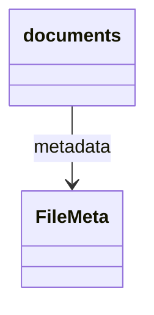

# 图论加速 AI 协作 — 技术实施方案

| 项 | 内容 |
| --- | --- |
| 版本 | v1.1.3 |
| 日期 | 2026-05-14 |
| 关联 | 各子仓 `docs/_tech_graph/` 拓扑与协议、Harness 多帽子流程、`_contract_manifest.json` / `graph.json`（并行互补）；**专题已填 Prompt** 见 [`prompts/README.md`](./prompts/README.md)（**不**放入 `docs/harness/prompts/`） |
| 实现工具 | Python 3.11+（脚本）、Cursor（工具调用）、CI（GitHub Actions / GitLab CI） |

## 概述

本方案基于已有 Mermaid 拓扑图（`.ai.md` 双轨制）与契约 JSON，补充机器可查询的依赖图，让 AI 在任务规划、影响分析时能以极低 token 消耗、确定性方式获取依赖关系。三个方案为递进关系，可根据项目规模选择实施。

## 架构决议与阶段门闸（人审 2026-05-14）

| 决议 ID | 内容 |
| --- | --- |
| **R1 图谱目录（Ink）** | 前后端统一采用子仓内 **`docs/_tech_graph/`**。前端 **`ai-ink-brain`** 若仍存在历史 **仓根** `_tech_graph/`，须先通过 **独立子仓 task** 完成目录迁入 `docs/_tech_graph/`（`git mv` 级移动 + 全仓引用与 CI/规则同步），再以前端路径绑定方案1 脚本与门禁。**仓库现状（工作区聚合仓 2026-05-14 复检）**：`ai-ink-brain` 仓内 **仅有** `docs/_tech_graph/`，仓根 **无** `_tech_graph/`，视为 **R1 物理条件已满足**；若某克隆仍见仓根目录，仍须按本段执行迁移 task 后再绑 CI。**与 `graph.json` CI**（与 [`SPEC/json_graph/scheme_1_graph_json.md`](SPEC/json_graph/scheme_1_graph_json.md)「已定稿」一致）：物理条件已满足时，**前端子仓 task 须**将 `graph.json` **导出 / `--check`** 纳入 **`quality` 等 PR 必绿**；异构克隆按上句先行 R1，**不得**以本地未迁移否定上游已采用的必绿策略。 |
| **R2 方案3 开启时序** | **仅在** **方案2** 已交付，且 **对比实验 B**（现状 vs 方案1 vs 方案2，见下表）形成书面结论后，再 **单独立项** 开启方案3（Neo4j）实施任务；本文与 `SPEC/neo4j/` 仅为方案3 **留坑**（接口位、验收占位、运维注意），不视为已开工。 |
| **R3 并存冲突** | 方案2（内存图）与方案3（Neo4j）**并存**且对同一查询 **结论冲突** 时，**以 Neo4j（DB）查询结果为准**。`graph.json` 仍保留为可 diff 的导出基线与向 DB 导入前的校验输入，**不以 JSON 覆盖 DB 已采纳的图语义**（导入策略在方案3 task 中写清）。 |
| **R4 阶段对比实验** | **每个方案实施完成后**须完成一轮 **对比实验** 并形成可追溯文档（指标定义、数据或仓库快照 id、复现命令、结论文档路径）；用于量化相对 **现状** 与 **前一方案** 的优劣，并作为下一阶段立项输入。 |

### 对比实验门闸（摘要）

| 闸口 | 对比组 | 产出（最低要求） |
| --- | --- | --- |
| **A**（方案1 后） | 现状 vs 方案1 | 实验小节或独立 md：解析正确性、`graph.json` 维护成本、CI 耗时或失败率等 |
| **B**（方案2 后） | 现状 vs 方案1 vs 方案2 | 同上：典型查询延迟、Agent 侧 token/轮次、影响集误报/漏报抽样结论等 |
| **方案3 立项** | 依赖 **B** 通过 + R2 | 在子仓 task 中引用 B 的结论与 **freeze_id**；再动 Neo4j 代码与运维 |

## 文档真值与并行关系（消歧）

### 图谱目录（前后端分仓）

| 承接仓 | 图谱根目录（相对该子仓根） |
| --- | --- |
| 后端 `ai-ink-brain-api-python` | `docs/_tech_graph/` |
| 前端 `ai-ink-brain` | `docs/_tech_graph/`（须经 **R1** 迁移到位后才是物理真值） |

凡文中出现 `docs/_tech_graph`，均指 **在对应子仓库根目录下** 执行或引用；与工作区根下 `docs/tech_graph/`（本规划 SPEC）不是同一目录。

### 专题 Prompt 落盘（强制）

- **已填、可复制** 的专题调用体（非 Harness 通模）一律放在 **[`prompts/`](./prompts/README.md)**；**禁止**再新增到 `docs/harness/prompts/`（该目录仅保留帽子母版与 `TEMPLATE-*` / `EXAMPLE-*`）。分工与命名见 `prompts/README.md`。

### `contract_manifest` 与 `graph.json`（并行、互补）

二者 **非替代**；CI 与本地校验可 **并行** 执行、独立失败：

| 维度 | `_contract_manifest.json`（及契约校验脚本） | `graph.json`（本方案导出） |
| --- | --- | --- |
| 描述对象 | SSE 等 **接口层** 字段契约 | **架构层** 模块调用、数据流依赖 |
| 节点类型 | 事件类型、字段名、枚举值 | 图中模块 id、类名等 |
| 边类型 | 事件 → 必需字段、payload 嵌套 | `depends_on`、`async_calls`、`condition`、元关系等 |
| 主要用途 | 生成/校验代码、前后端字段一致 | 影响分析、变更传播、任务规划 |
| 对 AI | 写对契约少读长文 | 「改 A 影响谁」少遍历代码 |

### 本专题 task / spec / invoke 落盘（工作区级）

与工作区规划配套的 **任务草案 / 指针**：`docs/tech_graph/tasks/…`（见该目录 `README.md`）。**承接仓级方案说明、与已定稿 `SPEC/` 配套的补充规约片段**：`docs/tech_graph/spec/…`（分目录与 `tasks/` 同型；**已定稿**专题规约仍以 [`SPEC/README.md`](SPEC/README.md) 为准）。**专题 Invoke 快照**：[`invokes/README.md`](invokes/README.md)。各子仓正式 task 仍走各仓既有目录。

## 三者关系

| 方案 | 名称 | 核心产出 | 适用规模 | 前置依赖 |
| --- | --- | --- | --- | --- |
| 方案1 | 静态依赖矩阵导出 | `graph.json` | 小～中（节点 <500） | Ink 前端：**R1**（以 **`docs/_tech_graph/`** 为唯一图谱根；物理条件判定与 PR 必绿见上表 **R1** 与 **v1.1.3**）；后端：无 |
| 方案2 | 内存图查询工具 | `tech_graph_graph_query.py` + Cursor 工具调用 | 中～大（节点 <2000） | 方案1 + **闸口 A** 对比实验归档 |
| 方案3 | 图数据库（Neo4j） | Neo4j 实例 + Cypher 查询接口 | 超大（节点 >1000） | 方案1 + 方案2 + **闸口 B** 对比实验归档 + **R2** 单独立项 |

## 方案1：静态依赖矩阵导出

### 1.1 目标

从 **`docs/_tech_graph/*.ai.md`**（在 **后端或前端子仓内**，见上文「图谱目录」）自动提取所有流程图（flowchart）的边关系，以及类图（classDiagram）的关联关系，生成与同目录对齐的 **`graph.json`**，供 AI 直接读取。前后端 **各生成一份**（默认不合并跨仓图）。

### 1.2 输入

- 目标仓下所有 `docs/_tech_graph/*.ai.md`（须符合该仓 `99_mermaid_protocol.md`）。
- 可选：同目录 `00_main.md`、`10_flow_*.ai.md` 等。

### 1.3 输出

`docs/_tech_graph/graph.json`（与输入同仓、同目录），结构如下：

```json
{
  "schema_version": "graph_v1",
  "generated_at": "2026-05-14T10:00:00Z",
  "nodes": ["rag", "fts", "text2sql", "supabase_rpc", "unified_chat", "code_chunks", "documents", "FileMeta"],
  "edges": [
    {"from": "rag", "to": "fts", "type": "depends_on", "sync": true},
    {"from": "rag", "to": "text2sql", "type": "depends_on", "sync": true},
    {"from": "text2sql", "to": "supabase_rpc", "type": "depends_on", "sync": true},
    {"from": "unified_chat", "to": "rag", "type": "triggers", "async": false},
    {"from": "documents", "to": "FileMeta", "type": "has_metadata"},
    {"from": "code_chunks", "to": "FileMeta", "type": "has_metadata"}
  ]
}
```

- **nodes**：所有出现的实体名（流程图节点、类图中的类名）。
- **edges**：每条有向边，`type` 可取值：
  - `depends_on`（默认）— 对应 `-->`
  - `async_calls` — 对应 `~>`
  - `condition` — 对应 `?>`
  - `has_metadata` — 对应 `classDiagram` 中的 `-->`
  - 其他元关系 `::xxx` 转为 `xxx`
- **sync**：布尔值，`true` 为同步（`-->` 或 `::xxx`），`false` 为异步（`~>`）。

### 1.4 技术实现

编写 Python 脚本 `tools/export_graph_json.py`：

1. 遍历入参指定的 `docs/_tech_graph/`（**相对于当前子仓根**，后端或前端二选一；可配置忽略 `99_*`）。
2. 用正则或轻量解析器提取：
   - flowchart 块中的边定义：`A --> B`、`A ~> B`、`A ?> B`、`A ::xxx B`。
   - classDiagram 块中的关联：`A --> B`。
3. 收集所有节点名（边两端的标识符）。
4. 输出 `graph.json` 到同一目录。
5. 若文件已存在，覆盖。

调用方式：

在 **后端或前端子仓根**（`cwd` 为 `ai-ink-brain-api-python` 或 `ai-ink-brain`）执行，路径相同：

```text
python tools/export_graph_json.py --input docs/_tech_graph --output docs/_tech_graph/graph.json
```

（脚本物理位置以落地 task 为准；若仅后端仓安装工具，前端可先由 CI 调用同一脚本并传入 `--input` 指向前端 checkout。）

### 1.5 集成到 CI

- 在 PR 流程中增加步骤：检查 `graph.json` 是否与源文件一致。
- 可运行脚本重新生成，然后 `git diff --exit-code` 检测变化；若有变化但 PR 未提交新的 `graph.json`，则 CI 失败并提示「请运行 `tools/export_graph_json.py` 并提交 `graph.json`」。

### 1.6 使用方式（AI）

在 `.cursorrules` 或帽子 Prompt 中增加：

> 在分析影响范围前，必须先读取 **当前修改所在子仓** 的 `docs/_tech_graph/graph.json`。该文件列出该仓图谱中的模块依赖；根据 `edges` 找出当前节点（`from`）的下游（`to`）。跨前后端影响需同时查阅两仓图谱或后续「合并视图」SPEC（若有）。

### 1.7 验收标准

- [ ] 脚本能正确解析至少 3 个示例 `.ai.md` 文件。
- [ ] 生成的 `graph.json` 节点数与 Mermaid 图中实际节点数一致。
- [ ] CI 集成后，修改 `.ai.md` 但不更新 `graph.json` 会触发失败。
- [ ] AI 能根据 JSON 回答「修改 X 会影响谁」并输出正确列表。
- [ ] **闸口 A**（现状 vs 方案1 对比实验）已形成可追溯文档并链入子仓 task 或 `docs/tech_graph/SPEC/json_graph/` 下约定路径。

## 方案2：内存图查询工具（Cursor 可调用）

### 2.1 目标

在方案1基础上，提供确定性图查询函数，AI 通过 Cursor 工具调用（`@tool` 或 `execute_command`）获取影响集，不再需要 AI 自己解析 JSON。

### 2.2 输入

方案1生成的 `graph.json`（或直接读取 Mermaid 源文件作为备选）。

### 2.3 输出

Python 模块 **`tools/tech_graph_graph_query.py`**（后端子仓真值；规划别名见下表）：

| 规划函数名 | 实现符号 | 描述 |
| --- | --- | --- |
| `get_downstream(node, depth)` | `query_downstream(store, node_id, depth)` | JSON 子图（含 nodes/edges/anchors） |
| `get_upstream(node, depth)` | `query_upstream(store, node_id, depth)` | JSON 子图 |
| — | `query_neighbors(store, node_id)` | 一跳邻域子图 |
| `has_path(from, to)` | `has_path(store, from_id, to_id)` | 有向路径存在性（`bool`） |
| `describe_impact(node)` | `describe_impact(store, node_id, depth=2)` | 人类可读影响描述（`str`） |
| `get_all_affected(nodes[], depth)` | `tools/tech_graph_gate_b_query_union.py` 等 | **非**本模块；多起点并集见 P2-4 |

详 SPEC：[scheme_2_graph_query.md](SPEC/query_graph/scheme_2_graph_query.md)。

### 2.4 技术实现

- 使用 `tech_graph_graph_query.py` 加载 `graph.json`（须 `schema_version: graph_v2`）构建邻接表；**`ref` 边不参与 BFS**。
- 查询基于 BFS，时间复杂度 O(N+E)。
- CLI（`execute_command`）：

```text
python tools/tech_graph_graph_query.py downstream AUTH 2
python tools/tech_graph_graph_query.py has-path AUTH RAG
python tools/tech_graph_graph_query.py describe-impact POOL 2
```

### 2.5 集成到 Cursor

- **方法A（简单）**：AI 使用 `execute_command` 调用 CLI 脚本，获取输出文本。
- **方法B（可选）**：将 CLI 注册为 Cursor MCP（子仓示例见 `.cursor/mcp.json.example`）；完整 MCP stdio 协议 **非**本阶段硬交付。

示例 `.cursor/mcp.json`（片段，路径相对于 `ai-ink-brain-api-python` 子仓根）：

```json
{
  "mcpServers": {
    "graph-query": {
      "command": "python",
      "args": ["tools/tech_graph_graph_query.py", "downstream", "AUTH", "2"],
      "cwd": "${workspaceFolder}/ai-ink-brain-api-python"
    }
  }
}
```

### 2.6 集成到 Harness 帽子

`docs/harness/prompts/TEMPLATE-task-audit-invoke.md` 已增 **可选** 步骤（**非**硬阻塞）：影响分析时可调用：

```text
python tools/tech_graph_graph_query.py describe-impact <node_id> 2
```

### 2.7 验收标准

- [x] `tech_graph_graph_query.py` 可通过命令行返回正确结果（含 `has-path` / `describe-impact`）。
- [ ] Cursor 能成功调用工具（通过 `execute_command` 或 MCP；MCP 为可选）。
- [ ] 在任务审计对话中，AI 自动使用工具并输出影响节点。
- [x] 未安装 Neo4j 时，方案2完全独立运行。
- [x] **闸口 B**（现状 vs 方案1 vs 方案2）**已完成** — 结论：`ai-ink-brain-api-python/docs/diary/jsonPKmermaid/reports/conclusion_gate_b_ctx_query_v1_zh.md`（graph_query task · **禁止**重跑 batch 主实验）。

## 方案3：图数据库（Neo4j）集成

### 3.1 目标

当项目规模增长到节点数 > 500、需要复杂图分析（最短路径、中心性、社区发现）时，引入 Neo4j 作为后端，提供更强大的查询能力。

### 3.2 前置条件

- 已有 `graph.json`（方案1）且 **闸口 A** 已完成。
- 方案2 已交付且 **闸口 B**（现状 / 方案1 / 方案2 性能与效果对比）已形成书面结论（**R2**）。
- 团队同意部署 Neo4j（可选用 Neo4j AuraDB 云服务或 Docker 本地），并已在子仓 **单独 task** 中立项（本文件不替代该 task 的 `failure_paths` / 验收）。

### 3.2.1 规划占位（方案3 未立项前）

- **冲突规则**：实现 `USE_NEO4J` 或双后端时遵守 **R3**（DB 优先）。
- **留坑文档**：`docs/tech_graph/SPEC/neo4j/scheme_3_neo4j.md` 持续维护骨架；对比实验报告建议落在同目录将来子文件夹 `eval/`（由方案3 task 创建）。

### 3.3 实现步骤

#### 3.3.1 数据导入脚本 `tools/import_to_neo4j.py`

1. 读取 `graph.json`。
2. 使用 Neo4j Python 驱动（`neo4j`）连接数据库。
3. 执行 Cypher 创建节点和关系（幂等）。

示例 Cypher：

```cypher
MERGE (m:Module {name: $name})
ON CREATE SET m.created_at = timestamp()
ON MATCH SET m.updated_at = timestamp()
```

关系创建：

```cypher
MATCH (a:Module {name: $from}), (b:Module {name: $to})
MERGE (a)-[r:DEPENDS_ON {type: $type}]->(b)
SET r.sync = $sync, r.updated_at = timestamp()
```

#### 3.3.2 查询封装（供 AI 使用）

在 `graph_query_neo4j.py` 中实现与方案2相同的函数签名，但内部使用 Cypher 查询数据库：

```python
def get_downstream_neo4j(node: str, depth: int = 1) -> List[str]:
    with driver.session() as session:
        result = session.run("""
            MATCH (start:Module {name: $node})-[:DEPENDS_ON*1..%d]->(end:Module)
            RETURN DISTINCT end.name
        """ % depth, node=node)
        return [record["end.name"] for record in result]
```

#### 3.3.3 统一接口（可选）

提供一个环境变量 `USE_NEO4J`，让 `graph_query.py` 自动切换后端（内存/Neo4j），保持上层调用不变。

### 3.4 使用场景举例

- 找出 `rag` 模块的两层依赖链：`get_downstream("rag", 2)` 返回 `["fts", "text2sql", "supabase_rpc"]`。
- 检查是否有循环依赖：执行 `CALL gds.alpha.closeness.stream()`。
- 找出最易受影响的模块（中心度）：用于架构评审。

### 3.5 运维要求

- Neo4j 需持久化存储，定期备份。
- CI 中不依赖 Neo4j（仅用于开发/生产环境）。
- 提供 `docker-compose.yml` 快速启动 Neo4j 测试实例。

### 3.6 验收标准

- [ ] 数据导入脚本可将 `graph.json` 完整导入 Neo4j。
- [ ] 在 **无冲突** 或 DB 已同步前提下，查询函数与方案2 **语义对齐**；若与内存实现不一致，以 **DB 结果为准**（**R3**），并在文档中说明差异处理策略。
- [ ] 复杂查询（如最短路径）可正确执行。
- [ ] 未连接 Neo4j 时，系统可回退到方案2的内存模式。
- [ ] **闸口 B** 已引用；方案3 专属对比实验（如 DB vs 内存大规模场景）已归档。

## 总体集成与 CI 增强

### CI 工作流（`.github/workflows/graph.yml` 示例）

```yaml
name: Graph Consistency Check

on: [pull_request]

jobs:
  check-graph-json:
    runs-on: ubuntu-latest
    steps:
      - uses: actions/checkout@v4
      - name: Setup Python
        uses: actions/setup-python@v5
        with:
          python-version: '3.11'
      - name: Install dependencies
        run: pip install pyyaml  # 如果需要
      - name: Regenerate graph.json
        run: python tools/export_graph_json.py --check  # --check 模式：若生成内容与现有文件不同则返回非0
      - name: Verify no diff
        run: git diff --exit-code docs/_tech_graph/graph.json
```

### 与现有 `tech_graph_contract_check.py` 的关系

- **并行互补**：`contract_check` 校验 **SSE 等契约**（`_contract_manifest.json`）；`graph.json` 校验 **架构依赖图** 与 `.ai.md` 一致。职责对照见 [SPEC/README.md](./SPEC/README.md) 中的对照表。
- 可在同一 CI job 内 **顺序执行**，二者 **独立失败**，互不替代。

## 实施路线图

| 阶段 | 任务 | 预计工时 |
| --- | --- | --- |
| 前置 | Ink 前端 **R1**：`_tech_graph/` → `docs/_tech_graph/` 迁移子仓 task | 视引用面而定 |
| 第1周 | 方案1：脚本、CI、规则/Prompt 引用 `graph.json`；完成后执行 **闸口 A** 对比实验并归档 | 1人日 + 实验 |
| 第2周 | 方案2：CLI/MCP、Harness 模板挂钩；完成后执行 **闸口 B** 对比实验并归档 | 1人日 + 实验 |
| 方案3 | **仅**在 **R2** 满足后单独立项：Neo4j 导入、查询封装、`docker-compose`、与 **R3** 一致的双后端策略 | 2人日起 |
| 后续 | 每阶段交付物与对比实验结论作为下一阶段 **freeze_id** 输入 | – |

## 附录：示例 `.ai.md` 边提取规则

### flowchart 示例

```mermaid
flowchart TD
  A --> B
  C ~> D
  E ?> F
  G ::process H
```

提取边：

```text
("A","B","depends_on",true)
("C","D","async_calls",false)
("E","F","condition",true)
("G","H","process",true)
```

### classDiagram 示例



提取边：`("documents","FileMeta","has_metadata",true)`

---

## 修订记录

| 版本 | 日期 | 摘要 |
| --- | --- | --- |
| v1.0 | 2026-05-14 | 初版：三方案、并行契约、CI 示例 |
| v1.1 | 2026-05-14 | 人审：R1 前端目录、R2 方案3 时序、R3 DB 优先、R4 与闸口 A/B 对比实验；路线图与验收联动 |
| v1.1.1 | 2026-05-14 | R1 补充：聚合仓内 `ai-ink-brain` 复检已仅有 `docs/_tech_graph/` |
| v1.1.2 | 2026-05-14 | 专题已填 Prompt 迁至 `docs/tech_graph/prompts/`，与 `docs/harness/prompts/` 分工 |
| v1.1.3 | 2026-05-14 | R1 与 scheme_1 / 子仓 task 对齐：**物理条件已满足时**前端 `graph.json` CI 可为 PR 必绿；方案1 前置依赖表述与 SPEC「仍待补全」消歧 |
| v1.1.3 勘误 | 2026-05-15 | R1 表：与 [`SPEC/json_graph/scheme_1_graph_json.md`](SPEC/json_graph/scheme_1_graph_json.md)「已定稿」一致，**须**将前端 `graph.json` 导出 / `--check` 纳入 **PR 必绿**；异构克隆不得否定上游必绿策略；**不**升版本号以免漂移 `freeze_id` |
